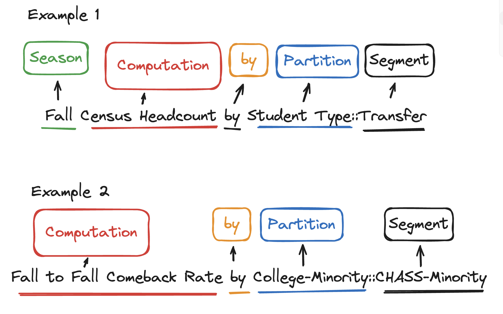

```{r, include = FALSE}
knitr::opts_chunk$set(
  collapse = TRUE,
  comment = "#>"
)
```

```{r setup, echo=FALSE}
library(utMetrics)
library(tidyverse)
library(DT)
```

## Metric Names
Metric names are designed to give a clear understanding of the metric.
Metric names are derived from components of the Metric.

- Season (if applicable)
- Computation
- by
- Partition(s) (if more than one partition they will be hyphenated)
- :: Segment(s) (if more than one segment they will be hyphenated)

### Example 1: Fall Census Headcount by Student Type::Transfer

 - Fall is the Season
 - Census Headcount is the Computation
 - by
 - Student Type is the Partition
 - :: notes there is a segment
 - Transfer is the Segment
 
 The Metric will show the Fall Census Headcount for Transfer (student type) students for the last 5 years.
 
### Example 2: Fall to Fall Comeback Rate by College-Minority::CHASS-Minority
 
- Season - not applicable
- Fall to Fall Comeback Rate is the Computation
- by 
- College-Minority - College, Minority are the Partitions (hyphenated)
- :: notes there is a segment
- CHASS-Minority - CHASS is the college Segment and minority is the Minority Segment (the two segments are hyphenated, i.e., CHASS-Minority).

The Metric will show the Fall to Fall Comeback Rate for CHASS (college) Minority (minority) students.


### Metric Name Diagram
{width=75%}

### List of Computations
List of Computations

```{r, echo=FALSE}
computations <- utMetrics::df_metrics_indices %>%
  select(computation) %>%
  arrange(computation) %>% 
  rename("Computation" = computation) %>% 
  unique()

datatable(computations)
```

### List of Computations and Partitions
List of Computations and Partitions

```{r, echo=FALSE}
partitions <- utMetrics::df_metrics_indices %>% 
  select(computation, partition) %>% 
  arrange(computation, partition) %>% 
  rename("Computation" = computation) %>% 
  rename("Partition" = partition) %>% 
  unique()

datatable(partitions)
```

### List of Metrics
List of Computations, Partitions, and Segments

```{r, echo=FALSE}
metric_list <- utMetrics::df_metrics_indices %>% 
  select(metric, computation, partition, segment) %>% 
  arrange(computation, partition, segment) %>% 
  rename("Computation" = computation) %>% 
  rename("Partition" = partition) %>% 
  rename("Segment" = segment) %>% 
  unique()

datatable(metric_list)
```
